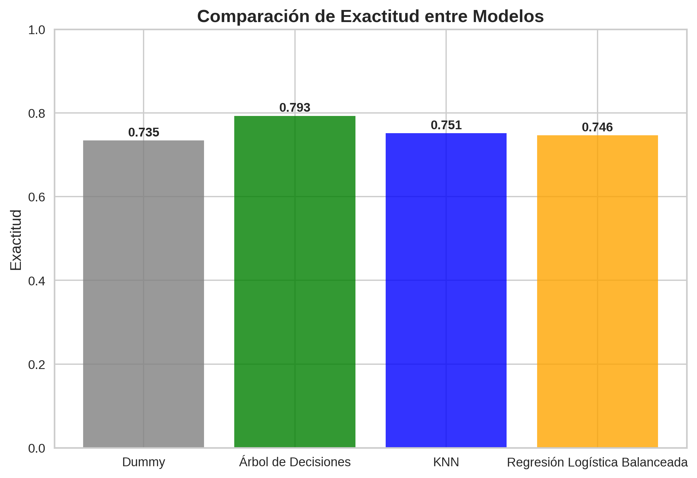
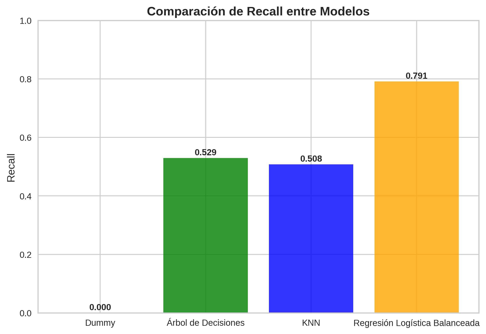

# TelecomX_Parte2_Latam_Predicci-n_Modelos

## INTROCUCCIÓN
La intención de realizar el proyecto es establecer modelos de predicción de **Churn** de clientes de la compañia **TelecomX_Latam** aplicando una estadistica descriptiva y aprendizaje automatico (Machine Learning). Por ende,  la compañia quiere conocer que tipo de clientes podrían permanecer o retirar los diferentes servicios que se ofrecen, para ello debemos establecer unas variables explicativas y la variable objetivo (respuesta) en nuestro modelo de Machine Learning. 

## Tabla de Contenido
* Descripción del proyecto
* Creación del repositorio en Github
* Listado de Bibliotecas a utilizar para el desarrollo del proyecto
* Extracción del archivo tratado (CSV)
* Eliminación de columnas irrelevantes
* Realizar el Encoding
* Verificación de la Proporción de Cancelación (Churn)
* Balanceo de Clases (opcional)
* Normalización o Estandarización (si es necesario)
* Correlación y Selección de Variables
* Análisis de Correlación
* Análisis Dirigido
* Modelado Predictivo
* Separación de Datos
* Creación de Modelos
* Evaluación de los Modelos
* Interpretación y Conclusiones
* Análisis de la Importancia de las Variables

1. **Descripción del Proyecto**
La compañia quiere anticiparse a la problematica de cancelación de servicios, para ello debemos analizar los datos historicos sobre nuestros clientes y servicios, posteriormente debemos establecer modelos de machine learning  para comparar su efectividad en la predicción de clientes (churn). Para ello vamos a establecer modelos como: **Baseline**, **Arbol de Decisiones**, **Random Forest** y comparar su rendimiento.

2. **Creación del repositorio en Github**
Para el desarrollo del proyecto realizamos la creación del repositorio en Github. donde se encontrará disponible el proyecto y ser usado libremente por cualquier persona que tenga interes. https://github.com/Starleen1996/TelecomX_Parte2_Latam_Predicci-n_Modelos.git

3. ** Listado de Bibliotecas a utilizar para el desarrollo del proyecto**
Para el desarrollo del proyecto realizamos el uso de diferentes bibliotecas Python entre ellas:
* import requests
* import json
* import pandas as pd
* import sklearn
* import pickle
* import numpy as np
* import seaborn as sns
* import matplotlib.pyplot as plt
* import warnings
* warnings.filterwarnings('ignore')
* import plotly.express as px
* import yellowbrick
* import DecisionTreeClassifier
* import train_test_split
* from sklearn.compose import make_column_transformer  # Este modulo ayuda a realizar una transformación de columnas
* from sklearn.preprocessing import OneHotEncoder # Ayuda a realizar transformación de 1 y 0
* from sklearn.model_selection import StratifiedKFold # Aseguramos que la proporción de cada clase se mantenga
* from sklearn.preprocessing import StandardScaler
* from sklearn.linear_model import LogisticRegression
* from sklearn.pipeline import Pipeline
* from sklearn.metrics import classification_report, confusion_matrix
* from sklearn.metrics import accuracy_score, confusion_matrix
* from imblearn.over_sampling import SMOTE
* from imblearn.pipeline import Pipeline as ImbPipeline
* from sklearn.dummy import DummyClassifier
* from sklearn.neighbors import KNeighborsClassifier

4. **Extracción del archivo tratado (CSV)**
Realizamos la extracción del archivo tratado (CSV), este ya se encuentra limpiado y normalizado con el fin de extraer las columnas que se encontraban en diccionarios, eliminar datos nullos y vacios, cambio del tipo de columnas entre otros.
url = 'https://raw.githubusercontent.com/Starleen1996/TelecomX_Parte2_Latam_Predicci-n_Modelos/refs/heads/main/df_clientes_LATAM.csv'

5. **Eliminación de Columnas irrelevantes**
Vamos a realizar la eliminación de la columna **ID_Cliente** ya que no aporta valor al análisis o al modelo predictivo

6. **Realizar el Encoding**
En este paso realizamos la transformación de las variables explicativas, excluyendo la variable de respuesta. para este paso primero hacemos la separación de las variables explicativas y la variable de respuesta.

X = datos.drop('cliente_vigente', axis=1)
y= datos['cliente_vigente']

posteriormente realizamos la transformación de los datos (Encodig) utilizando la biblioteca sklearn.compose y el modulo make_columns_transformer, sklearn.preprocessing import OneHotEncoder.
En la transformación de datos, logramos que las variables categoricas queden de forma binaria (0 y 1), esto se hace con el procesamientos de los datos en nuestros modelos de machine learning no presenten errores o sesgos.

7. **Verificación de la Proporción de Cancelación (Churn)**
 Verificando la proporción de cancelación vemos un desbalance en la variable (clientes vigentes), para ello utilizamos el metodo **datos.value_counts('cliente_vigente')**
0 = Clientes que siguen en la compañia  (5174 Clientes)
1 = Clientes que se han retirado en la compañia (1869 Clientes)
Con el fin de que ambas clases  queden con igual proporción de los datos vamos a realizar una estratificación (balanceo) en nuestra variable objetivo o de respuesta.
8. **Balanceo de Clases (opcional)**
9. **Normalización o Estandarización (si es necesario)**
10. **Correlación y Selección de Variables**
Realizamos la correlación entre las variables númericas, entre ellas la variable objetivo (respuesta) **Churn** para verificar el resultado respecto a las variables explicativas. Para ello realizamos un filtro de las variables tipo (int64', 'float64) y posteriormente calculamos la correlación con el metodo (corr()), finalmente para tener una mejor visualización de las correlaciones, realizamos un grafico (Heatmap) con laa biblioteca Seaborn.
11. **Análisis Dirijido de Correlación:**

Número de meses_contrato vs total_pagado_cliente: 0.825
Muy fuerte correlación positiva.
Significa que cuanto más meses tiene el cliente en contrato, mayor es el total pagado.
Es esperable: más tiempo = más facturación.
    
Número de meses_contrato vs cliente_vigente: -0.352
Correlación negativa moderada.
Sugiere que a mayor número de meses en contrato, hay cierta tendencia a que el cliente ya no esté vigente (abandone el servicio).
No es muy fuerte, pero hay relación.

total_pagado_cliente vs cliente_vigente: -0.199
Correlación negativa débil.
Indica que los clientes que han pagado más, tienden ligeramente a no estar vigentes, pero la relación es débil (casi cercana a 0).

**En Resumen:**

La variable más fuerte es:
#_meses_contrato ↔ total_pagado_cliente (0.825).
Existe un patrón de rotación de clientes:
mientras más tiempo y más pagan, hay una ligera probabilidad de que ya no estén vigentes (correlaciones negativas con cliente_vigente).
Pero esas correlaciones negativas no son lo suficientemente fuertes como para sacar conclusiones absolutas; se debería complementar con otros análisis.

12. **Modelado Predictivo:**
    
Modelos recomendados para este caso

* Regresión Logística:

Punto de partida clásico para problemas de clasificación binaria.

Te da interpretabilidad (puedes ver qué variable aumenta o disminuye la probabilidad de estar vigente).

Puede verse afectada por la multicolinealidad entre meses_contrato y total_pagado_cliente.

* Árboles de Decisión:

No tienen problema con colinealidad.

Fácil de interpretar en forma de reglas (ej: "si meses_contrato > X entonces...").

* Random Forest o Gradient Boosting (XGBoost, LightGBM, CatBoost):

Muy recomendados cuando quieres mayor precisión.

Manejan bien relaciones no lineales y colinealidad.

Random Forest → bueno para empezar.

XGBoost/LightGBM → mejor rendimiento si tienes más datos.

* Redes Neuronales (opcional, si tienes muchos datos):

Podrían aplicarse, pero en un dataset pequeño o con pocas variables no aporta mucho más que un modelo de boosting.+

13. **Separación de Datos**
Realizamos la separación de los datos para entrenamiento y prueba, lo recomendable es usar el 70/80 porciento para entrenamiento y 30/20 porciento para probar el modelo, para ellos utilizamos el modulo import train_test_split de la biblioteca sklearn.modelselection.

14 - 15 **Creación y Evaluación de modelos**

## Modelo de referencia (BaseLine)
Modelo Dummy
Un modelo base es muy importante para definir un criterio de comparación para modelos más complejos. En esta etapa, crea un modelo base con el DummyClassifier y encuentra la tasa de acierto con el método score.

El modelo más simple de clasificar los datos es simplemente utilizar un algoritmo que asigna todas las clasificaciones a la clase que tiene mayor frecuencia. Este algoritmo sirve como un criterio de comparación para identificar si los otros modelos tienen un rendimiento mejor que la clasificación más simple posible.

**Modelo Baseline (DummyClassifier):**
#Obtuvo un score de 0.7345 aproximadamente.
#Este modelo sirve únicamente como punto de referencia, ya que no aprende patrones reales de los datos, sino que sigue una estrategia trivial (por ejemplo, predecir siempre la clase mayoritaria).

## Modelo Árbol de Decisión
Para la clasificación de clientes (Churn), vamos a usar el modelo **+Árbol de Decisiones** ya que es uno de los modelos recomendados para predecir datos y clasificarlos.
Justificación Normalización: Para este modelo aunque no es necesario normalizar nuestros datos, decidí hacerlo ya que en el análisis de correlación no pude determinar una fuerza positiva o negativa sobre la variable objetivo (churn).

El modelo de árbol de decisión es muy utilizado debido a su alta explicabilidad y procesamiento rápido, manteniendo un rendimiento bastante interesante.
Se basa en decisiones simples tomadas por el algoritmo, separando los datos mediante comparaciones de menor y mayor en los valores de las columnas de la base de datos.

**Modelo_arbol = DecisionTreeClassifier(max_depth=5, random_state=42)**
Evaluamos el modelo con datos de prueba con una profundidad de 5 y estado de aleatoriedad de 42
modelo_arbol.fit(X_train, y_train)
modelo_arbol.score(X_test,y_test)

**Score en datos de prueba (X_test): 0.7931**

**Score en datos de entrenamiento (X_train): 0.8079**

**📊 Resumen**

Mejora frente al baseline: Antes, tu Árbol sin restricciones estaba cerca de 0.73 en test, ahora subió a ~0.79, lo cual indica que limitar la profundidad ayudó al modelo a generalizar mejor.

Generalización adecuada: La diferencia entre entrenamiento (0.8079) y prueba (0.7931) es muy pequeña (~0.015). 👉 Esto es una señal positiva: el modelo no está sobreajustado y mantiene un desempeño bastante estable en datos no vistos.

Impacto del hiperparámetro max_depth: Al limitar la profundidad a 5, el modelo evitó memorizar los datos de entrenamiento y logró un balance entre sesgo y varianza.

**✅ Conclusión**

El ajuste de profundidad mejoró la capacidad de generalización del Árbol de Decisión.

El modelo ahora supera claramente al baseline y tiene un buen equilibrio entre entrenamiento y prueba.

Aún se podría explorar más hiperparámetros (criterio de división, número mínimo de muestras por hoja, etc.), pero ya se evidencia un avance significativo.

## Modelo Regresión Logístico
**Resumen del Modelo Regresión Logística - Sin Balanceo**
📊 Resultados obtenidos

Accuracy (Exactitud) en prueba (X_test, y_test) Esto significa que, de todos los clientes en tu conjunto de prueba, el modelo predice correctamente si se quedan o se van en un 79.7% de los casos.

Accuracy (Exactitud) en entrenamiento (X_train, y_train) En los datos con los que el modelo aprendió, acierta en un 80.9% de los casos.

🔎 **Interpretación**

Generalización: Los resultados de entrenamiento (80.9%) y prueba (79.7%) son muy similares → el modelo no está sobreajustado (no memorizó los datos) y generaliza bien a nuevos clientes.

Buen desempeño inicial: Acertar casi en 8 de cada 10 clientes es un desempeño razonable para un primer modelo.

Limitaciones de Accuracy: En churn, muchas veces el problema está desbalanceado (es decir, hay más clientes que permanecen que los que se retiran). El accuracy puede ser engañoso, porque el modelo podría estar prediciendo bien a los que permanecen y fallando en los que se van, que suelen ser los más importantes para la empresa.

✅ **En conclusión:** Tu modelo logra ~80% de aciertos y generaliza bien, lo cual es un buen punto de partida. El siguiente paso es profundizar en métricas como recall para clientes que abandonan, ya que para la empresa es más costoso no detectar a un cliente que se va que equivocarse en un cliente que se queda.

1.**Matriz de confusión**

[[1382 170]

[ 258 303]]

1382 (Verdaderos Negativos, VN): Clientes que realmente NO se fueron (0) y el modelo predijo correctamente que se quedan.

170 (Falsos Positivos, FP): Clientes que el modelo predijo que se iban, pero en realidad se quedaron.

258 (Falsos Negativos, FN): Clientes que realmente se fueron, pero el modelo dijo que se quedaban.

303 (Verdaderos Positivos, VP): Clientes que realmente se fueron y el modelo lo predijo correctamente.

📊 **2. Reporte de clasificación**

Para clase 0 (clientes que permanecen):

Precision = 0.84: El 84% de los que predijo como "no se van" realmente no se fueron.

Recall = 0.89: Detecta bien a los que se quedan (89%).

F1-Score = 0.87: Buen balance entre precisión y recall. 📌 El modelo es bastante sólido para identificar clientes que se quedan.

Para clase 1 (clientes que se van = churn):

Precision = 0.64: De todos los que el modelo predijo que se iban, solo el 64% realmente se fue.

Recall = 0.54: Solo detecta al 54% de los clientes que efectivamente se fueron.

F1-Score = 0.59: Débil en comparación con la clase 0. 📌 Aquí está el problema: el modelo no está capturando bien a los clientes que hacen churn.

**📊3. Métricas generales**

Accuracy (exactitud) = 0.80: El modelo acierta en el 80% de los casos. ⚠️ Pero este número está sesgado porque hay muchos más clientes que se quedan (clase 0) que los que se van (clase 1).

Macro avg (0.73 en F1): Promedio simple entre ambas clases (muestra que el modelo es más débil en la clase 1).

Weighted avg (0.79 en F1): Promedio ponderado según la cantidad de ejemplos, está dominado por la clase 0.

**Conclusión para la empresa de telecomunicaciones:**

El modelo es bueno detectando quiénes se quedan (clase 0).

Pero es regular detectando quiénes se van (clase 1, churn) → solo identifica al 54% de ellos.

En términos de negocio: 🔹 Puedes confiar bastante en los clientes que el modelo dice que se quedarán. 🔹 Pero deberías mejorar la sensibilidad (recall) para no perder clientes que realmente se van.

## Modelo Regresión Logístico con Balanceo
🔍**Interpretación**

El modelo ya mejoró bastante el recall de la clase 1 (79%) gracias a SMOTE ✅.

Esto significa que ahora detecta a la mayoría de los clientes que abandonan (lo que pediste en el punto 1).

Pero hay un costo: la precisión para clase 1 bajó a 0.51, lo que implica más falsos positivos (clientes que el modelo cree que se van, pero en realidad no).

**Modelo KNN - SIN BALANCEO**
El algoritmo KNN se basa en el cálculo de la distancia entre los registros de la base de datos y busca elementos que estén cerca unos de otros (vecinos) para tomar la decisión de clasificación.

Debido a que utiliza cálculos de distancia, este algoritmo está influenciado por la escala de las variables, y por eso es necesario realizar una transformación en los datos antes de utilizar este método.

**2. Reporte de clasificación**

Para clase 0 (clientes que permanecen):

Precision = 0.83: El 83% de los que predijo como "no se van" realmente no se fueron.

Recall = 0.84: Detecta bien a los que se quedan (84%).

F1-Score = 0.83: Buen balance entre precisión y recall. 📌 El modelo es bastante sólido para identificar clientes que se quedan.

Para clase 1 (clientes que se van = churn):

Precision = 0.53: De todos los que el modelo predijo que se iban, solo el 53% realmente se fue.

Recall = 0.51: Solo detecta al 51% de los clientes que efectivamente se fueron.

F1-Score = 0.52: Débil en comparación con la clase 0. 📌 Aquí está el problema: el modelo no está capturando bien a los clientes que hacen churn.

# Conclusiones Exactitud de los Modelos:
Resultados reportados:

Modelo Dummy (baseline): 0.7345

Árbol de Decisiones: 0.7931

KNN: 0.7515

Regresión Logística (balanceada): 0.7463

🔎 **Conclusiones principales**:

Comparación con el modelo Dummy

El modelo Dummy sirve como referencia (predice lo más frecuente o al azar).

Todos los modelos superan la exactitud del Dummy, lo cual indica que sí están aprendiendo patrones reales en los datos.

Árbol de Decisiones → Mejor exactitud (0.7931)

Es el modelo con mejor desempeño global en términos de exactitud.

Sugiere que los datos pueden tener relaciones no lineales y jerárquicas que el árbol captura mejor que KNN o la regresión logística.

KNN (0.7515) vs. Regresión Logística (0.7463 balanceada)

Ambos tienen un rendimiento similar, aunque el KNN ligeramente mejor.

El hecho de que la Regresión Logística balanceada esté cerca al KNN indica que el desbalance de clases sí afecta al dataset, y balancear ayuda a no perder sensibilidad hacia la clase minoritaria (churn).

Importancia del balanceo

Aunque la regresión balanceada no tiene la mayor exactitud, su fortaleza está en mejorar el recall de los clientes churn (clase 1).

La exactitud por sí sola puede ser engañosa en datasets desbalanceados: un modelo puede tener buena exactitud pero ser malo prediciendo churn.

📝 **Conclusión final exactitud**:

El modelo Dummy alcanza una exactitud del 73.4%, lo que representa nuestra línea base. Todos los modelos superan este valor, confirmando que aprenden patrones útiles. El Árbol de Decisiones se posiciona como el mejor clasificador en términos de exactitud (79.3%), lo que indica que logra capturar relaciones complejas en los datos. Por su parte, KNN (75.1%) y la Regresión Logística balanceada (74.6%) tienen un rendimiento similar, aunque la regresión balanceada aporta la ventaja de mejorar la detección de clientes en riesgo de churn gracias al ajuste frente al desbalance de clases. En conclusión, el Árbol de Decisiones es el más preciso globalmente, pero la Regresión Logística balanceada puede ser preferida si el objetivo principal es mejorar la sensibilidad en la predicción de clientes que se van.

# Conclusiones del Recall
📌 Conclusiones del recall por modelo:

**Modelo Dummy (0.0000)**

El modelo no logra identificar ningún cliente que hace churn (1).

Esto confirma que el modelo dummy no es útil como predictor, solo sirve como referencia de base.

**Árbol de Decisiones (0.5294)**

Logra identificar un poco más de la mitad de los clientes que hacen churn.

Aunque es un avance respecto al dummy, aún deja escapar casi la mitad de los clientes que realmente abandonan.

Puede estar sobreajustando o priorizando otras métricas (como exactitud) en lugar de la sensibilidad.

**KNN (0.5080)**

Tiene un rendimiento muy similar al árbol de decisiones en términos de recall.

Esto sugiere que KNN tampoco logra capturar con suficiente eficacia los casos minoritarios de churn, posiblemente por la distribución de clases desbalanceada.

**Regresión Logística Balanceada (0.7914)**

Es el modelo que mejor logra identificar a los clientes que abandonan.

Con casi un 80% de recall, se convierte en el más prometedor si la prioridad es detectar churn, aunque podría sacrificar algo de precisión en las predicciones.

Esto confirma que aplicar técnicas de balanceo de clases es clave para este problema.

✅ Conclusión general: El modelo de regresión logística balanceado es el más adecuado si el objetivo del negocio es maximizar la detección de clientes en riesgo de abandono, ya que ofrece un recall muy superior. En contraste, árbol de decisiones y KNN se comportan de forma similar pero insuficiente, y el modelo dummy es completamente ineficaz.

**Grafico Exactitud Modelos:**

16. **Análisis de la Importancia de las Variables:**

**Regresión Logística Balanceada:**
La ventaja de este modelo es que es interpretable:

Cada variable tiene un coeficiente (peso) → indica cómo cambia la probabilidad de cancelación.

El signo del coeficiente:

(+) → aumenta la probabilidad de churn.

(-) → reduce la probabilidad de churn.

La magnitud absoluta → indica la importancia relativa de la variable.

**KNN:**
KNN no tiene coeficientes, pero puedes investigar las variables con:

Análisis de distancias → ver cuáles variables más contribuyen a diferenciar clientes que cancelan vs. los que no.

Feature importance vía permutación:

Se mide cómo cambia el desempeño del modelo si "rompes" (permutas) una variable.

Si el recall baja mucho, esa variable es clave.

**Árbol de Decisiones:**
Aquí es mucho más visual:
El árbol aprende umbrales de decisión (ejemplo: "si el cliente tiene más de 6 meses → menos probabilidad de churn").
Puedes ver la importancia de variables directamente del modelo.

## Agradecimientos 🤝

Quiero agradecer a Oracle y Alura LATAM por proporcionar las bases y el material necesarios para la realización de este proyecto, y por su alianza que hace posible este programa de capacitación para el desarrollo del futuro en tecnología.

 

**Desarrollador del Proyecto:**
Realizado por: Starleen Gaviria Medina, Estudiante de Alura Latam, Ciencia de datos.

www.linkedin.com/in/starleen-gaviria-sig
